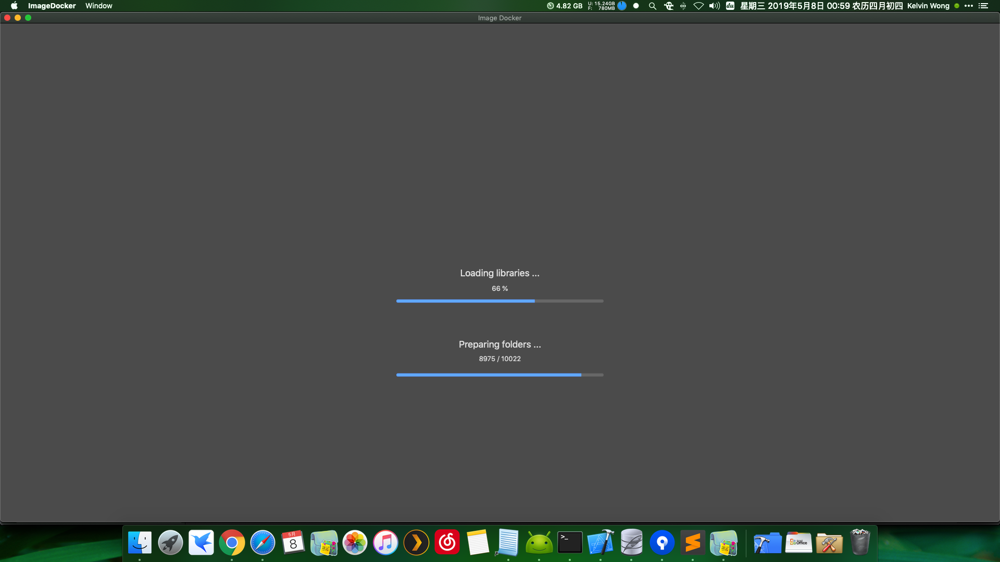
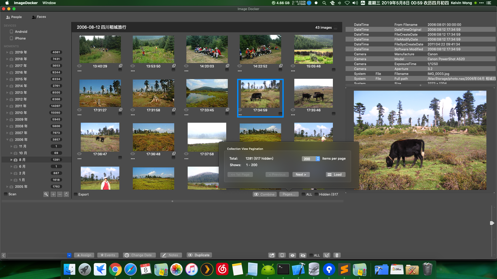
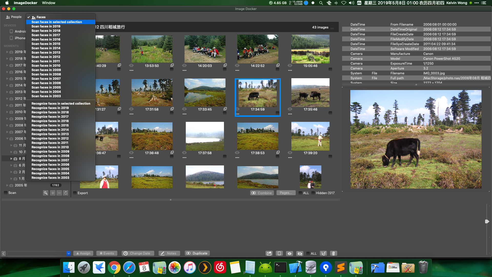
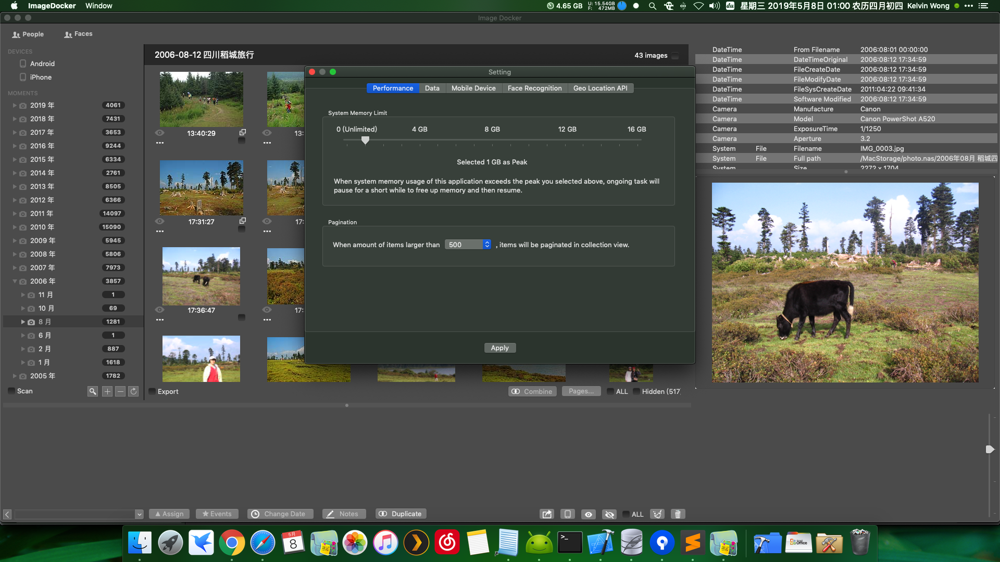
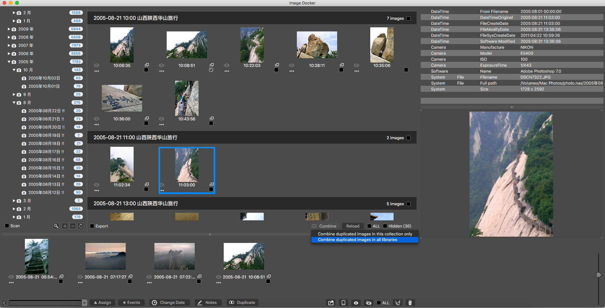
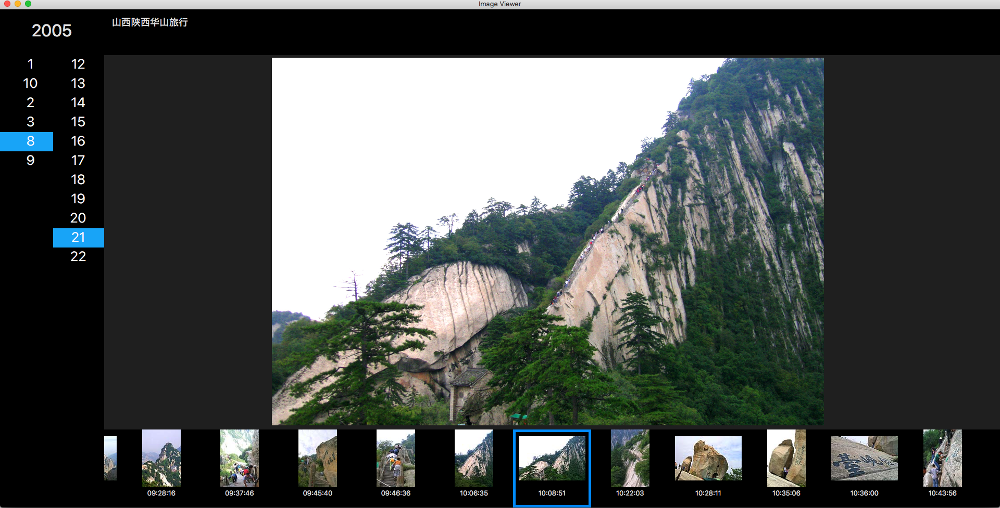
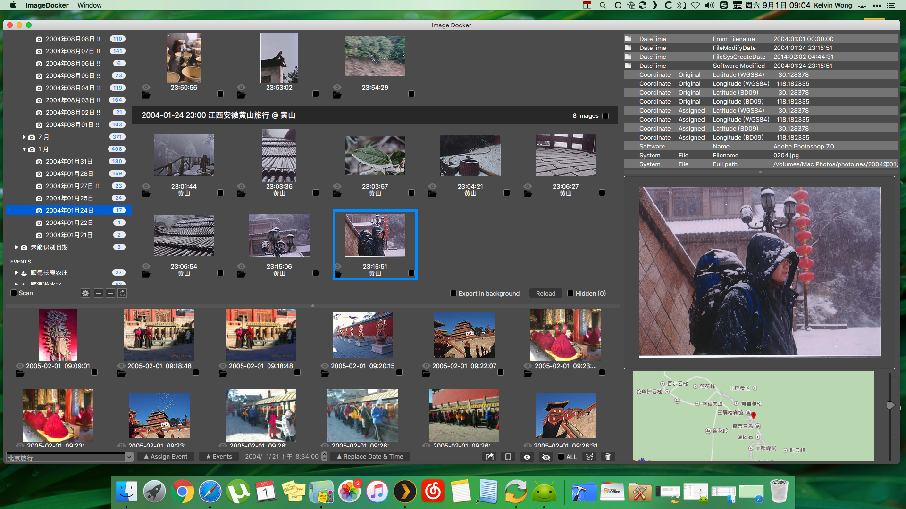

# ImageDocker

A desktop application help organize pictures and videos between cameras/mobile devices and Plex Media Server.

 

## Major objectives

- Import images from local directories and mobile devices
- Change photo-taken-date and geolocation of images
- Export images to another directory in well-organized directory structure to feed Plex Media Server

## Features

- Organize images by directories, dates, events and places.
- EXIF information, such as dates, geolocation, camera models, etc. Could be modified in batch.
- Detect and recognize faces.

## Screenshot
v0.10.0
New feature: splash screen on startup

New feature: pagination for collection view

New feature: scan and recognize faces (required dlib+python libraries)

New feature: performance control

v0.9.4
New feature: combine similar images into a group

New feature: Larger view of image

v0.9.3

## Dependencies

- [PostgresClientKit](https://github.com/codewinsdotcom/PostgresClientKit): to manage data in PostgreSQL database ([Apache Licence 2.0](https://github.com/codewinsdotcom/PostgresClientKit/blob/master/LICENSE))
- [GRDB](https://github.com/groue/GRDB.swift): to manage data in a SQLite database ([The MIT License](https://github.com/groue/GRDB.swift/blob/master/LICENSE))
- [ACBTokenField](https://github.com/akhilcb/ACBTokenField) ([The MIT License](https://github.com/akhilcb/ACBTokenField/blob/master/LICENSE))
- [SwiftyJSON](https://github.com/SwiftyJSON/SwiftyJSON) ([The MIT License](https://github.com/SwiftyJSON/SwiftyJSON/blob/master/LICENSE))
- [CryptoSwift](https://github.com/krzyzanowskim/CryptoSwift) ([License](https://github.com/krzyzanowskim/CryptoSwift/blob/master/LICENSE))
- [ExifTool](https://www.sno.phy.queensu.ca/~phil/exiftool/): to load EXIF info from images ([Perl License](https://www.sno.phy.queensu.ca/~phil/exiftool/#license))
- [Android Debug Bridge](https://developer.android.com/studio/command-line/adb): to detect and access Android devices ([License](https://developer.android.com/license))
- [dlib](https://github.com/davisking/dlib): to help recognize faces
- [face_recognition](https://github.com/ageitgey/face_recognition): to help recognize faces ([The MIT License](https://github.com/ageitgey/face_recognition/blob/master/LICENSE))
- [libimobiledevice](https://github.com/libimobiledevice/libimobiledevice): to detect and pair iOS devices ([LGPL License](https://github.com/libimobiledevice/libimobiledevice/blob/master/COPYING))
- [ifuse](https://github.com/libimobiledevice/ifuse): to access iOS devices ([LGPL License](https://github.com/libimobiledevice/ifuse/blob/master/COPYING))
- [Baidu Map API](http://lbsyun.baidu.com): to recognize geolocation inside China, and to display maps ([License](http://lbsyun.baidu.com/index.php?title=open/law))
- [Google Map API](https://developers.google.com/maps/documentation/): to recognize geolocation outside China ([License](https://developers.google.com/terms/site-policies))

## Prerequisite

- Personal AP key of Baidu Map API is required for displaying maps and recognizing geolocations inside China
- Personal AP key of Google Map API is required for recognizing geolocations outside China
- OSX Fuse or iFuse should be installed before user try to load photos from iOS devices by ImageDocker
- Android device needs to enable USB debug mode before connecting to computer via USB, so that Android Debug Bridge can access the files in the device. It would be better install [HandShaker](https://formulae.brew.sh/cask/handshaker) for easier transfer images from Android device to computer, although this application has been discontinued.

## PLEASE NOTE

- This software supports screen resolution equal or larger than 1920 x 1080 . It would probably behave ugly on smaller screens, such as Macbook Air non-retina models.
- This software does not need Internet as soon as you don't need to know about where the pictures were taken, as it would need API from Google Map or Baidu Map. Only latitude and longitude of the pictures would be transfered thru Internet.
- Remember to backup pictures and videos before using any versions of this software.
- Any pre-release versions of this software is applied to author/developer for testing / debugging only.

## License

[The MIT License](LICENSE)
